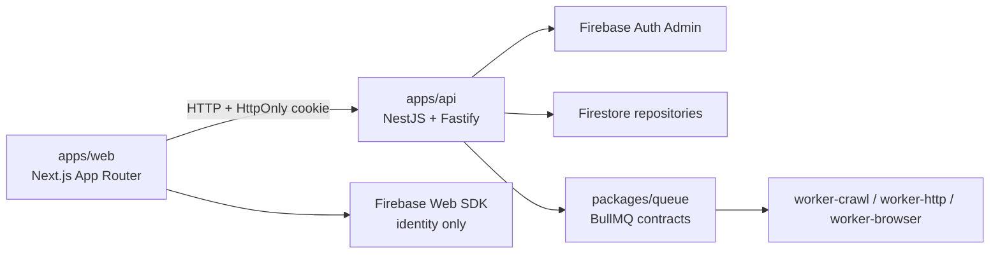
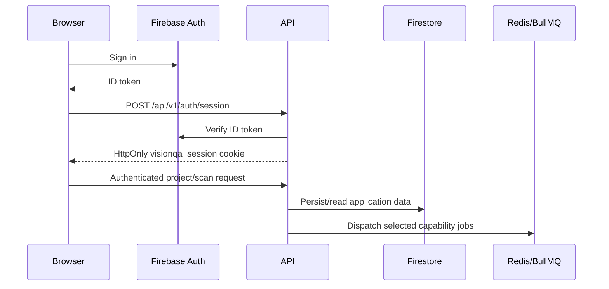

# Architecture

Accessibility & SEO scans reuse the browser worker and persisted issue/evidence model. The worker collects a bounded page metadata and accessibility snapshot, applies only the selected deterministic checks, and stores normalized findings; no separate worker or remote analysis service is introduced.
## Current overview

VisionQA is a pnpm/Turborepo monorepo for a modular website QA product. The current system has a Next.js dashboard, a NestJS/Fastify API, Firebase-backed application repositories, shared contracts, queue contracts, and scaffolded workers.

## Workspace structure

- `apps/web`: App Router pages, auth forms, dashboard layout, project context, URL-first scan UI, and CSS styling.
- `apps/api`: Nest modules for auth, projects, scans, environment loading, and the health endpoint.
- `apps/worker-crawl`: BullMQ worker with bounded HTTP/HTML crawling, robots parsing, bounded sitemap discovery, resource-reference extraction, frontier management, and Firebase quality/page persistence. `apps/worker-http` validates selected link/resource targets and persists normalized results/issues. `apps/worker-browser` runs isolated Playwright contexts with request interception, bounded browser facts, and screenshot evidence.
- `apps/scheduler`: bounded durable schedule poller that claims Firebase `ScheduleRun` occurrences and calls the API’s normal scan-creation boundary.
- `packages/contracts`: framework-independent domain and API types, including projects, environments, scans, and statuses.
- `packages/database`: repository interfaces, Firebase Admin repositories, Firebase Storage adapter, Prisma schema/client compatibility path.
- Browser results use separate bounded repository queries for page executions and browser facts; screenshot metadata is stored in Firestore while screenshot bytes remain in private Firebase Storage.
- `packages/queue`: queue names, typed job payloads, execution-plan types, dispatcher abstraction, and BullMQ dispatcher.
- `packages/detector-sdk` and `packages/detectors`: detector interfaces and the current detector metadata catalog.
- Visual geometry is collected once per browser execution and passed to selected deterministic detectors in `packages/detectors`; findings are normalized through the existing issue repository, and responsive findings compare the selected viewport executions after the set completes.
- For accepted visual findings, the browser worker preserves the original `SCREENSHOT`, renders bounded geometry into a separate private `VISUAL_ANNOTATION`, records bounded metadata, and attaches both evidence references to the issue occurrence. Annotation failures are logged and do not invalidate the finding or scan.
- The `interactions-forms` module reuses the browser worker and isolated Playwright contexts. It discovers bounded candidates, classifies them through one safety policy, runs only explicitly selected checks, resets the page between attempts, and persists normalized interaction findings with bounded before/after screenshot evidence when needed.
- The `performance-compatibility` module reuses the browser worker. A completed navigation produces one bounded `PerformanceSnapshot` from browser Performance APIs and selected performance detectors persist actionable issues; compatibility executions use the same isolated browser boundary and are only comparable when multiple engines actually run.
- Performance-1.1 extends that flow as `Target → per-browser BrowserExecution → PerformanceSnapshot → performance detectors → normalized browser facts → BrowserCompatibilityComparisonService → compatibility findings → Issue/Occurrence → Performance & Compatibility UI`. Browser jobs are dispatched per requested engine; no engine is replaced when its runtime is unavailable. Compatibility comparisons are keyed by normalized page URL and viewport, bounded to the selected browser matrix, and report `NOT_COMPARED`, `CONSISTENT`, `DIFFERENCES_FOUND`, or `PARTIAL` when coverage is incomplete.
- Custom Checks use a typed declarative definition. Project-scoped definitions are validated and versioned in Firebase; selected definitions are copied into the immutable scan snapshot as `customCheckSnapshots`. The browser worker evaluates snapshots against bounded DOM, metadata, and performance facts, persists `PASS`, `FAIL`, `SKIPPED`, or `ERROR` results under the scan, and creates normalized issues for failures. Authenticated CRUD/preview and result/summary/findings APIs are project-scoped; no user code or custom URLs are executed.
- Full Scan is orchestration over the same detector catalog and workers. Creation snapshots `target`, scope, explicit module/check selections, browser/viewport configuration, options, custom definitions, detector catalog version, and a `full-scan-1` execution plan. `FullScanCapabilityPlanner` groups selected checks into shared Crawl, HTTP, and one Browser task per requested engine; site-scope downstream tasks depend on the bounded crawl inventory. Capability and module states are persisted separately from immutable plan data, and workers advance the aggregate only after their authoritative task reaches a terminal state. Browser tasks carry all selected browser modules so a page/browser/viewport execution collects shared facts once while detectors still filter strictly by selected check IDs. For site scope, the browser worker reloads the persisted fetched HTML crawl inventory, filters and canonicalizes eligible same-origin pages, prioritizes the root and shallow pages, applies the bounded page cap, and records the selected inventory on the scan. It then creates deterministic page/browser/viewport execution records, reuses one context per execution, isolates page failures, and reports partial coverage without silently substituting a browser. Responsive checks use the configured viewport union; non-responsive checks use the smallest required viewport set. Terminal browser coverage is reconciled against prior issue occurrences using detector, normalized page, browser/viewport, and custom-check version identity before stale findings are marked fixed.
- Schedules persist a project-scoped reusable `ScheduledScanTemplate` and explicit IANA-timezone `ScheduleRecurrence`. The standalone scheduler polls enabled Firebase schedules in bounded batches, transactionally claims `ScheduleRun` by `scheduleId + scheduledFor`, skips overlapping runs, and calls the API’s internal trigger boundary. That boundary invokes the normal `ScansService.create` path, which snapshots current custom-check versions and creates the ordinary immutable execution plan; the scheduler never dispatches crawl, HTTP, or browser jobs directly. Schedule edits affect future runs only, deletion archives scheduling metadata while retaining scans and run history, and one recent missed occurrence is allowed before the scheduler resumes from the next future occurrence.
- `packages/network-policy`: outbound URL validation for protocol, private/loopback/metadata hosts, and optional domain allowlists.
- `packages/auth`, `packages/config`, `packages/evidence`, `packages/integrations`, `packages/observability`, `packages/reporting`, and `packages/ui`: small shared contracts/scaffolds; their current exports are limited.

## Request and persistence flow

1. The web client uses Firebase Web Auth for sign-in/registration.
2. The web client posts the Firebase ID token to `apps/api`.
3. The API verifies the token with Firebase Admin and sets `visionqa_session` as an HttpOnly cookie.
4. Authenticated API controllers use `FirebaseSessionGuard` and delegate to services.
5. Project and environment services use Firebase repositories. Active project data is loaded into the web `ProjectProvider`.
6. Scan creation validates selected checks, persists a Firestore scan, builds a capability plan, and dispatches typed queue jobs.

## Boundaries and transitional paths

- Controllers own HTTP routing, Zod request validation, and HTTP error translation. Services coordinate business operations. Repositories isolate persistence.
- Firebase is the active provider for identity, user profiles, projects, environments, and scans. New scans persist their target snapshot under `projects/{projectId}/scans/{scanId}`; nested environments remain readable legacy/optional configuration.
- Prisma/Postgres remains modeled in `packages/database/prisma/schema.prisma` and is used by the legacy password/session service. It is not the active Firebase project workflow.
- Queue contracts dispatch crawl/HTTP/browser jobs without credentials. New jobs receive the persisted scan target selected by the API, and workers reload that target from the scan when processing; workers retain their own outbound network validation. Crawl discovery persists page/resource inputs; the HTTP worker validates deduplicated targets and persists normalized resource results and issue occurrences. The browser worker owns rendered execution, bounded geometry snapshots, screenshot evidence, and deterministic visual checks; site-wide fan-out uses the persisted crawl inventory and bounded per-engine execution loops rather than treating a queue payload URL as the page authority. Interaction-specific logic remains future capability.
- The product target model is URL-first: `Project → Scan.target → Scan execution`. Environments and project `baseUrl` fields are legacy/optional and are not required by new scan creation or the primary dashboard shell. Historical scans without a target remain readable through their legacy environment reference.
- Scheduled scans carry optional `triggerSource`, `scheduleId`, and `scheduleRunId` provenance on the normal Scan document; manual scans remain valid without schedule metadata. Scan idempotency keys make retries reuse the same scan document and queue identities.
- Detector SDK interfaces and metadata exist, but the detector catalog currently describes mostly planned checks.
- Evidence, integrations, and scheduler packages retain transitional interfaces/readiness scaffolds; reporting now has an immutable Firebase-backed snapshot flow, API, and printable web view.

Reports are immutable snapshots built by `@visionqa/reporting` from authoritative Scan, module state, Issue, crawl, resource, browser, evidence, and custom-check result data. `ReportsService` owns authorization and orchestration, `ReportBuilder` performs bounded deterministic normalization without target-site requests, and `FirebaseReportRepository` stores each generated version under the project. The web report route renders persisted snapshots as printable HTML; PDF artifacts are intentionally not implemented in Reports-1.

## Dependency direction

Prefer dependencies from applications toward shared packages. Shared packages must not import UI or application modules. Keep Firestore calls in `packages/database`; keep BullMQ wiring in `packages/queue` or infrastructure; keep browser-facing code in `apps/web`.
