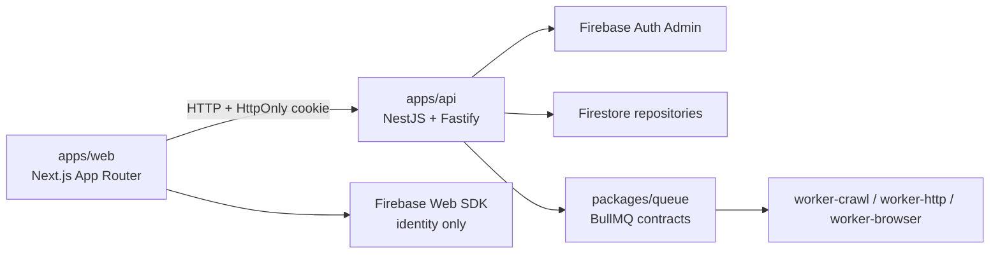
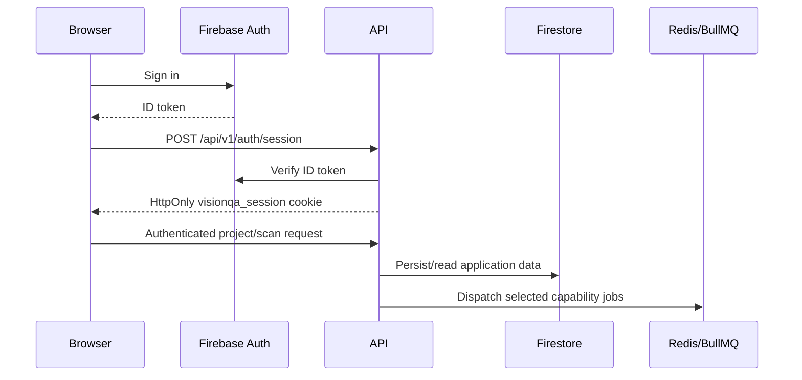

# Architecture

## Current overview

VisionQA is a pnpm/Turborepo monorepo for a modular website QA product. The current system has a Next.js dashboard, a NestJS/Fastify API, Firebase-backed application repositories, shared contracts, queue contracts, and scaffolded workers.

## Workspace structure

- `apps/web`: App Router pages, auth forms, dashboard layout, project context, scan UI, and CSS styling.
- `apps/api`: Nest modules for auth, projects, scans, environment loading, and the health endpoint.
- `apps/worker-crawl`: BullMQ worker with bounded HTTP/HTML crawling, robots parsing, bounded sitemap discovery, resource-reference extraction, frontier management, and Firebase quality/page persistence. `apps/worker-http` validates selected link/resource targets and persists normalized results/issues. `apps/worker-browser` runs isolated Playwright contexts with request interception, bounded browser facts, and screenshot evidence.
- `apps/scheduler`: scheduler entry point; currently a readiness scaffold.
- `packages/contracts`: framework-independent domain and API types, including projects, environments, scans, and statuses.
- `packages/database`: repository interfaces, Firebase Admin repositories, Firebase Storage adapter, Prisma schema/client compatibility path.
- Browser results use separate bounded repository queries for page executions and browser facts; screenshot metadata is stored in Firestore while screenshot bytes remain in private Firebase Storage.
- `packages/queue`: queue names, typed job payloads, execution-plan types, dispatcher abstraction, and BullMQ dispatcher.
- `packages/detector-sdk` and `packages/detectors`: detector interfaces and the current detector metadata catalog.
- Visual-1 geometry is collected once per browser execution and passed to selected deterministic detectors in `packages/detectors`; findings are then normalized through the existing issue repository.
- `packages/network-policy`: outbound URL validation for protocol, private/loopback/metadata hosts, and optional domain allowlists.
- `packages/auth`, `packages/config`, `packages/evidence`, `packages/integrations`, `packages/observability`, `packages/reporting`, and `packages/ui`: small shared contracts/scaffolds; their current exports are limited.

## Request and persistence flow

1. The web client uses Firebase Web Auth for sign-in/registration.
2. The web client posts the Firebase ID token to `apps/api`.
3. The API verifies the token with Firebase Admin and sets `visionqa_session` as an HttpOnly cookie.
4. Authenticated API controllers use `FirebaseSessionGuard` and delegate to services.
5. Project and environment services use Firebase repositories. Active project data is loaded into the web `ProjectProvider`.
6. Scan creation validates selected checks, persists a Firestore scan, builds a capability plan, and dispatches typed queue jobs.

## Boundaries and transitional paths

- Controllers own HTTP routing, Zod request validation, and HTTP error translation. Services coordinate business operations. Repositories isolate persistence.
- Firebase is the active provider for identity, user profiles, projects, environments, and scans. Firestore documents use paths such as `users/{uid}`, `projects/{projectId}`, nested environments, and nested scans.
- Prisma/Postgres remains modeled in `packages/database/prisma/schema.prisma` and is used by the legacy password/session service. It is not the active Firebase project workflow.
- Queue contracts dispatch crawl/HTTP/browser jobs without credentials. Crawl discovery persists page/resource inputs; the HTTP worker validates deduplicated targets and persists normalized resource results and issue occurrences. The browser worker owns rendered execution and evidence collection; detector-specific visual and interaction logic remains future capability.
- Detector SDK interfaces and metadata exist, but the detector catalog currently describes mostly planned checks.
- Evidence, integrations, reporting, and scheduler packages are interfaces or readiness scaffolds rather than complete product flows.

## Dependency direction

Prefer dependencies from applications toward shared packages. Shared packages must not import UI or application modules. Keep Firestore calls in `packages/database`; keep BullMQ wiring in `packages/queue` or infrastructure; keep browser-facing code in `apps/web`.
